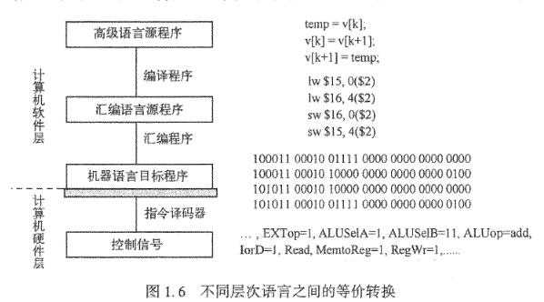

#+title: Basic Overview
#+author: Hongbin Qu
#+date: <2026-09-07 Mon>
#+hugo_section: en/cs/org-arch
#+hugo_tags: "computer organization and architecture"
#+hugo_categories: "cs" "org-arch"
#+hugo_custom_front_matter: :logs ""
#+hugo_custom_front_matter: :logs_descripe ""

* 计算机系统概述

+ 计算机基本工作原理
  + 冯诺伊曼结构基本思想
     + 存储程序·程序控制
     + 计算机由运算其,控制器,存储器,输入设备,输出设备五大基本部件
     + 存储器能放数据,也能放指令
     + 计算机内部以二进制的形式表示指令和数据；每条指令由 *操作码* 和 *地址码* 两部分组成

#+begin_quote
存储器能放数据,也能放指令. 那么CPU区把拿到等二进制是指令还是数据?
1. 时间维度(最核心、最本质的区别是CPU执行周期是固定的)
   在“取指”阶段,CPU获取的二进制串肯定就是“操作命令”
   在“执行”阶段,指令被解析后，CPU就知道要进行什么操作了（例如加法运算），这时候去内存获取参与运算的具体数值。这个时候获取的二进制串肯定是“数据”
2. 空间维度
   指令地址来源：程序计数器(PC)永远指向下一条要执行的指令在内存中的地址，只要地址是PC提供的，CPU就知道取回来的肯定是指令
   数据地址来源：当一条指令被取出来并解析后，指令内部会有一个“地址码”。CPU会根据这个地址去内存指定位置，把里面的内容当作“数据”拿去出来
#+end_quote

** 程序和指令的执行过程
   *指令* 用来表示CPU完成一个特定的原子操作，例如
   | 指令  | 操作                                       |
   | load  | 从主存单元取出数据存放到通用寄存器         |
   | store | 将通过寄存器的内容写道主存单元             |
   | add   | 将两个通用寄存器内容相加后送入结果寄存器   |
   | mov   | 将一个通用寄存器的内容送到另一个通用寄存器 |

   指令通常被划分成若干个字段，有操作码、地址码等等。
   + 操作码：指令的操作类型，如取数(load)、存数(store)、传送(mov)、加减(add/mul)等等
   + 地址吗：指令要处理的数据地址，如寄存器编号、主存单元地址等等
    
   + 指令执行步骤
     + 取指令
     + 指令译码
     + PC增量
     + 取数并执行
     + 送结果

#+begin_quote
现代CPU都使用流水线技术，可以很大程度上提升CPU执行指令的效率
#+end_quote

** 程序的开发与运行
  + 汇编语言和机器语言都属于低级语言，它们统称为 *机器级语言*
  + 汇编程序( A s s e m b l e r ) ：也称汇编器。用于将汇编语言源程序翻译成机器语言目标程序。
  + 解释程序(Interpreter)：也称解释器。用于将源程序中的语句按其执行顺序逐条翻译成机器指令并立即执行。
  + 编译程序（Compiler）： 也称编译器。用于将高级语言源程序翻译成汇编语言或机器语言目标程序。
  汇编程序、解释程序、编译程序等转换为机器语言的都认为是 *翻译程序*
  
实现两个相邻数组元素交换功能的不同层次语言之间的等价转换过程

交换数组元素v[k]和[k+1]的功能可以在高级语言源程序中直观地用三条赋值语句实现。在经编译后生成的汇编语言源程序中，可用4条汇编指令实现该功能，1其中，两条是取数指令M（LoadWord）5另外两条是存数指令5卬（StoreWord）0在经汇编后生成的机器语言程序中，对应的机器指令是特定格式的二进制代码，例如，第一条加指令对应的机器代码为u10001100010011110000000000000000n,这是一条MIPS指令系统中的指令，其中，高6位“100011”为操作码，随后5位“00010”为通用寄存器编号2,再后面5位“01111”为另一个通用寄存器编号15,最后16位为立即数0。CPU能够通过逻辑电路直接执行这种二进制表示的机器指令。指令执行时通过控制器对指令操作码进行译码，以解释成控制信号来控制数据的流动和运算，例如，控制信号ALUop=add可以控制FALU进行加法操作，RegWr=1可以控制将结果数据写入某个通用寄存器。

| 抽象层级 / 类别  | 实现方式 / 示例 | 详细说明 / 组成要素                                                                                                                         |
|------------------+-----------------+---------------------------------------------------------------------------------------------------------------------------------------------|
| 高级语言源程序   | 3条赋值语句     | 直观地实现数组元素 v[k] 和 v[k+1] 的交换功能。                                                                                              |
| 汇编语言源程序   | 4条汇编指令     | 包含2条取数指令（LoadWord）和2条存数指令（StoreWord）。                                                                                     |
| 机器语言程序     | 二进制代码      | 特定格式的机器指令，例如：10001100010011110000000000000000（MIPS指令系统中的加指令）。                                                      |
| MIPS指令格式解析 | 字段划分        | 1. 高6位 100011：操作码；2. 随后5位 00010：通用寄存器编号2；3. 再后面5位 01111：通用寄存器编号15；4. 最后16位：立即数                       |
| 指令执行过程     | 硬件控制        | CPU通过逻辑电路直接执行二进制指令；控制器对操作码译码生成控制信号（如 ALUop=add 控制ALU加法，RegWr=1 控制写入寄存器）以控制数据流动和运算。 |

** 从源程序到可执行文件
1. *源程序存储形式* ：源程序（如 ~hello.c~ ）以文本文件形式存放，使用 ASCII 码（或汉字字符）编码，可显示和可读。
2. *开发到执行的完整流程* ：从高级语言源程序到可执行文件，需经过 *预处理、编译、汇编、链接* 四个阶段。
3. *各阶段工具与输出* ：
   - 预处理（cpp）处理 ~#~ 开头的指令（如 ~#include~ ），输出仍是源程序 (~.i~)
   - 编译（ccl）将预处理后的源程序翻译为汇编语言程序（~.s~），与机器结构相关，不同高级语言在同一机器上生成相同汇编格式。
   - 汇编（as）将汇编程序转为可重定位目标文件（~.o~），为二进制文件，不可读。
   - 链接（ld）将多个可重定位目标文件（包括库函数）合并为最终的可执行目标文件（无扩展名或 ~.exe~ 等），保存在硬盘上。
4. *文件类型* ：源程序（文本）、汇编程序（文本）、可重定位目标文件（二进制）、可执行文件（二进制）。
5. *示例命令* ： ~gcc -o hello hello.c~ 可一次性完成上述四个阶段。

 四个阶段转换表格

| 阶段 | 输入文件 | 处理工具 | 输出文件 | 主要操作 | 输出文件类型 |
|------|----------|----------|----------|----------|--------------|
| 预处理 | ~hello.c~ （源程序） | 预处理程序（cpp） | ~hello.i~ | 处理以 ~#~ 开头的指令（如 ~#include~、~#define~），展开宏，嵌入头文件内容 | 文本文件（源程序） |
| 编译 | ~hello.i~ （预处理后的源程序） | 编译程序（ccl） | ~hello.s~ | 将高级语言源程序翻译为与机器相关的汇编语言程序 | 文本文件（汇编程序） |
| 汇编 | ~hello.s~ （汇编语言源程序） | 汇编程序（as） | ~hello.o~ | 将汇编指令转换为机器指令，生成可重定位目标文件（二进制） | 二进制文件（可重定位目标文件） |
| 链接 | ~hello.o~ + 库文件（如 ~printf.o~ ） | 链接程序（ld） | ~hello~ （可执行文件） | 合并多个可重定位目标文件，解析外部符号引用，生成最终可执行文件 | 二进制文件（可执行目标文件） |

** 可执行文件的启动和执行

1. *启动方式* ：可执行文件可通过双击图标或命令行输入文件名启动；在UNIX中通过shell命令行解释器执行（如 ~./hello~ ）。
2. *shell的作用* ：shell是操作系统外壳程序，提供人机交互环境，读取用户输入的命令，并调用内核服务例程加载程序。
3. *键盘输入到内存* ：用户输入的字符（如 ~./hello~ ）依次被读入CPU寄存器，再存入主存缓冲区形成字符串。
4. *内核加载程序* ：按下Enter键后，shell调用内核服务例程，将磁盘上的可执行文件加载到主存储器中。
5. *程序执行起点* ：内核将可执行文件的第一条指令地址送入程序计数器（PC），CPU据此开始执行。
6. *输出过程* ：执行时，程序将主存中的字符串 ~"hello, world\n"~ 逐字符取到CPU寄存器，再送至显示器显示。
7. *操作系统支持* ：用户程序依赖操作系统内核提供的系统调用（如 ~read~ 、 ~write~ ）访问外设（键盘、磁盘、显示器）。
8. *外设与控制器* ：外设（I/O设备）通过设备控制器（如显卡、网卡）连接主机；控制器中含有数据缓冲寄存器。
9. *数据流动* ：程序执行本质是数据在CPU、主存、I/O模块之间通过总线和桥接器流动；数据在传输前需缓存在存储部件（寄存器、缓存）中。

+ 可执行文件执行过程表格

| 步骤 | 阶段/操作 | 涉及的硬件/软件 | 数据流动（方向） | 说明 |
|------|-----------|----------------|------------------|------|
| ① | 用户输入命令 | 键盘 → CPU寄存器 | 外设 → CPU | 用户通过键盘键入 ~./hello~ ，每个字符被读入CPU的通用寄存器 |
| ② | 命令存入主存 | CPU寄存器 → 主存（缓冲区） | CPU → 主存 | 字符从寄存器保存到主存的缓冲区，形成完整命令行字符串 |
| ③ | 内核加载可执行文件 | 磁盘 → 主存（通过DMA或CPU） | 磁盘 → 主存 | 用户按下Enter后，shell调用内核服务例程，将磁盘上的 ~hello~ 可执行文件加载到主存储器 |
| ④ | 设置程序计数器（PC） | 内核 → CPU（PC） | 主存 → CPU | 内核将加载后的程序第一条指令地址写入PC，CPU准备执行 |
| ⑤ | CPU取指令并执行 | CPU（PC指向主存） | 主存 → CPU（取指令） | CPU不断从主存取指令、译码、执行；执行过程中访问主存中的字符串数据 |
| ⑥ | 输出数据到显示器 | CPU寄存器 → 显示器（通过I/O控制器） | CPU → 外设 | 程序将主存中的 ~"hello, world\n"~ 逐字符读入CPU寄存器，再通过显示控制器送到显示器显示 |
| ⑦ | 程序结束，返回shell | CPU → 操作系统 | - | 执行完毕后，控制权交还shell，shell显示新提示符 |

**补充说明** ：
- 整个过程中的数据流动依赖*系统总线* （处理器总线、存储器总线、I/O总线）和*桥接器* （如南/北桥）。
- 各部件中的 *缓冲存储* （如CPU寄存器、设备控制器的数据缓冲寄存器）用于暂存数据，以匹配不同速度的部件。
- 用户程序不直接访问硬件，而是通过 *操作系统内核的系统调用* （如 ~read~ 、 ~write~ ）完成I/O操作。

命令解释程序请求内核创建或替换进程映像；加载器依据可执行文件的程序头建立虚拟地址映射，动态链接器解析共享库，运行时启动代码准备参数和环境后调用

#+begin_quote
“加载”通常是建立映射而非立即把整个文件复制进内存；页面按需调入。容器并未改变 ELF 与进程的基本机制，只是通过命名空间、jail、cgroup 或资源限制改变进程所见环境
#+end_quote

** 计算机系统层次结构
1. *从应用到机器语言的转换流程（问题转换）*
   + 应用问题最初用自然语言描述。  
   + 经过 *算法抽象* 、 *高级语言程序设计* （如C语言）等步骤，最终转换为特定机器语言目标程序。  
   + 这个转换涉及多个抽象层，每个层都逐步将问题向硬件可执行的形式靠近。

2. *开发支撑环境（高级语言程序）*
   + 编写源程序需要 *程序编辑器* 。  
   + 翻译转换软件包括 *预处理器、编译器、汇编器、链接器* 。  
   + 这些工具通常集成在 *集成开发环境（IDE）* 中，统称为*语言处理系统* 。  
   + 用户界面（图形或命令行，如shell）和底层系统调用服务由 *操作系统（OS）* 提供，操作系统本身是对底层硬件的抽象。

3. *软硬件接口——指令集体系结构（ISA）*  
   + ISA是软件和硬件之间的“桥梁”，定义了计算机可执行的所有指令的集合。  
   + 每条指令规定了操作、操作数地址空间和操作数类型。  
   + 机器语言程序就是ISA指令的序列，硬件执行程序即逐条执行这些指令。

4. *ISA的实现——微体系结构（微架构）*  
   + 实现ISA的电路逻辑结构称为 *微架构* （或计算机组织）。  
   + ISA与微架构是不同层面的概念：例如，是否提供加法指令属于ISA问题，而加法器采用何种进位方式属于微架构问题。  
   + 相同的ISA可以有多种不同的微架构实现（如不同型号的x86处理器），从而保证程序兼容性。

5. *硬件层次的向下分解*  
   + 微架构由 *功能部件* 构成。  
   + 功能部件通过 *逻辑电路* 实现，不同逻辑实现方式影响性能和成本。  
   + 基本逻辑电路由 *器件技术* （如晶体管、集成电路工艺）实现。

6. *涉及的参与角色*  
   + 最终用户关注应用（问题）。  
   + 程序员负责算法和编程。  
   + 架构师定义ISA和微架构。  
   + 电子工程师设计电路和器件。

**核心层次关系（自上而下）** ：  
应用问题 → 算法 → 高级语言程序 → 机器语言程序（ISA层面） → 微架构 → 功能部件 → 逻辑电路 → 器件技术。  
每一层都是对下层的抽象，上层依赖下层提供的服务，同时屏蔽下层细节。上层通过 API/ABI 使用下层服务；ISA 是软件与硬件的关键边界。抽象让程序员无需掌握晶体管细节，但性能或错误分析往往需要跨层追踪。

** 计算机系统的不同用户
1. 最终用户关注应用功能
2. 应用程序员面向API
3. 系统程序员关心ABI、ISA和OS
4. 系统管理员关注部署、资源与安全；硬件设计者实现微架构。

在计算机技术中，一个存在的事物或概念从某个角度看似乎不存在，即对实际存在的事
物或概念感觉不到，则称为透明。通常，在一个计算机系统中，系统程序员所看到的底层机
器级的概念性结构和功能特性对高级语言程序员（通常就是应用程序员）来说是透明的，
也即看不见或感觉不到的。不同用户看到的系统接口不同。

| 抽象层（虚拟机器名） | 工作在该层的用户 | 该层用户的主要工作 | 使用的工具/语言/接口 | 为什么称为“虚拟机” |
|----------------------|------------------|--------------------|----------------------|----------------------|
| *应用程序层* （无特定虚拟机名） | *最终用户* （如办公人员、游戏玩家） | 直接使用应用程序解决实际问题（如文字处理、浏览网页） | 应用程序（如Word、浏览器）、图形用户界面（GUI） | 该层不是“虚拟机”，而是真实应用运行层，用户只关心功能，不涉及下层细节。 |
| *高级语言虚拟机* （语言处理系统层） | *应用程序员* （高级语言程序员） | 用高级语言编写程序，解决算法/业务逻辑 | 高级语言（C、Java、Python）、编译器/解释器、IDE、库函数 | 这一层通过编译器/解释器将高级语言翻译为下层机器语言，程序员感觉是在一台“能直接执行高级语言”的机器上编程，屏蔽了底层ISA细节，因此称为虚拟机。 |
| *汇编语言虚拟机* | *汇编语言程序员* | 用汇编语言编写底层程序，直接控制硬件资源（如设备驱动、启动代码） | 汇编语言、汇编器（as）、调试器 | 汇编器将汇编指令翻译成机器码，程序员看到的是“能理解助记符指令”的机器，实际底层是二进制机器指令，所以是虚拟机器。 |
| *操作系统虚拟机* | *系统管理员* | 管理计算机资源、用户权限、文件系统，部署和维护软件环境 | 操作系统命令（shell、图形管理工具）、系统调用接口 | 操作系统为用户提供了一个“扩展机器”，隐藏了裸机硬件（如磁盘、内存）的复杂管理，程序员/管理员看到的是文件、进程等抽象概念，底层硬件被虚拟化了。 |
| *机器语言机器* （ISA层） | *系统程序员* （机器语言程序员） | 编写机器语言程序或直接操作ISA指令，开发编译器、操作系统内核等底层系统软件 | 指令集体系结构（ISA）、机器指令、汇编器（部分）、调试工具 | 这一层直接对应硬件实现（微架构），但ISA本身是对硬件电路的一种抽象定义，程序员看到的是“指令执行”的抽象模型，而非实际晶体管或数据通路，因此也是一台“虚拟”的指令执行机器。 |

**补充说明** ：
+ “虚拟机”在此并非指VMware等虚拟化软件，而是指 *通过软件层对下层硬件或功能进行抽象，为用户提供一种更易用的编程/操作接口* ，使每一层用户都感觉自己拥有一台“能直接理解和执行自己语言或命令的专用计算机”。
+ 层次越往上，抽象程度越高，对底层细节隐藏越深；越往下，越接近物理硬件。

** 计算机层次关联
*** 1. 程序编译转换的“前端”与“后端”
编译过程以 *中间代码生成为界* 划分为两个阶段：
 *前端（与语言相关）* ：负责词法、语法、语义分析，并生成中间代码。其核心任务是 *分析源程序* ，必须严格遵循高级编程语言的 *标准规范* 。
 *后端（与机器相关）* ：负责将中间代码转化为目标机器代码并进行优化。其核心任务是 *综合生成目标程序* ，必须严格遵循目标机器的 *ISA（指令集体系结构）* 和 *ABI（应用程序二进制接口）规范* 。

#+begin_quote
在现代程序中扮演着 *编译器基础设施* 的核心角色——LLVM(Low Level Virtual Machine),它是一个高度模块化的编译器“框架”，核心价值在于引入了一个统一的 *中间表示(IR,Intermediate Representation)* ，解决了传统编译个框架下"NxM"复杂问题;其还用于构建 *即时编译器（JIT）* 、静态分析工具等等
#+end_quote

现代软件开发中是GCC\G++等传统编译器和LLVM为代表的clang现代编译器混合开发

*** 2. 程序行为异常的三类原因（语言标准层面）
若程序执行结果不符合预期，通常源于程序员对语言标准规范的认知偏差，具体分为三类行为：

 *未定义行为 (Undefined Behavior)* ：标准未规定该情况下的行为。 *结果完全不可预测* ，不同平台或不同时刻执行结果可能不同（如 ~printf~ 格式符与参数类型不匹配）。
 *未指定行为 (Unspecified Behavior)* ：标准提供多种可行选项，由编译器自行决定。 *同一编译器版本行为一致，但不同编译器结果可能不同* （如函数参数的求值顺序）。
 *实现定义行为 (Implementation-Defined Behavior)* ：编译器厂商必须明确记录其选择。*同一平台行为稳定，但移植到其他平台可能不同* （如 ~char~ 类型是否视为有符号整数）。

*** 3. 后端生成目标代码的双重约束（ISA 与 ABI）
 *ISA（指令集体系结构）* ：定义了硬件能执行的指令集合及操作规范。后端生成的目标代码必须符合ISA，否则无法在对应硬件上运行。
 *ABI（应用程序二进制接口）* ：规定了目标代码在特定操作系统平台上的底层机器级约定（如函数调用约定、系统调用方式、寄存器使用、虚拟地址空间划分等）。 *不符合ABI的目标程序无法在对应的操作系统环境中运行* 。
 *API 与 ABI 的区别* ：API是源代码与库之间的高层接口（与硬件无关），支持跨平台编译；而ABI是二进制层面的接口， *ABI相同或兼容时* ，编译好的目标代码可直接运行，无需重新编译。

*** 4. 三层（硬件、操作系统、应用程序）的制约关系
 *操作系统层面* ：必须依据 *ABI规范* 为应用程序提供运行时环境，同时必须依据 *ISA规范* 使用硬件接口（如控制寄存器、中断机制等）。
 *硬件层面* ：处理器设计必须完全遵循 *ISA规范* ，提供对应的硬件接口，以支撑操作系统和应用程序的正常运行。

简而言之： *前端看语言标准，后端看ISA和ABI；程序员需注意未定义/未指定/实现定义行为以避免歧义；操作系统和硬件分别作为ABI/ISA的执行者，共同构成程序的运行平台。*

** 计算机性能测试

---

*** 一、核心知识点总结

**** 1. 性能基本指标

| 指标 | 含义 | 适用场景 |
| *吞吐率（Throughput）*  | 单位时间内完成的工作量 | 多媒体、批处理 |
| *响应时间（Response Time）* | 从作业提交到完成的时间 | 事务处理、交互系统 |
| *带宽（Bandwidth）* | 单位时间内传输的信息量 | 网络、总线 |

**** 2. CPU 时间的分解

用户感觉到的执行时间分为：
- *用户CPU时间* ：真正运行用户程序代码的时间（ *性能评价的核心* ）
- *系统CPU时间* ：为执行用户程序而运行操作系统代码的时间
- *其他时间* ：等待I/O或执行其他用户程序的时间

**** 3. 关键概念与公式（★计算核心）

**三个基本参数：**
- *时钟周期* ：CPU主脉冲信号的宽度
- *时钟频率（主频）* ：时钟周期的倒数，$f = 1/T$
- *CPI（Cycles Per Instruction）* ：执行一条指令所需的平均时钟周期数

**核心公式链：**

$$\text{用户CPU时间} = \frac{\text{程序总时钟周期数}}{\text{时钟频率}} = \text{程序总时钟周期数} \times \text{时钟周期}$$

$$\text{程序总时钟周期数} = \text{程序总指令条数} \times \text{CPI}$$

$$\text{程序总时钟周期数} = \sum_{i=1}^{n} (C_i \times CPI_i)$$

$$\text{综合CPI} = \sum_{i=1}^{n} (CPI_i \times f_i) = \frac{\text{程序总时钟周期数}}{\text{程序总指令条数}}$$

其中 $f_i$ 为第 $i$ 种指令在程序中所占的比例。

**最终公式：**

$$\text{用户CPU时间} = CPI \times \text{程序总指令条数} \times \text{时钟周期}$$

**** 4. 性能比较

$$\frac{\text{性能}_{M1}}{\text{性能}_{M2}} = \frac{\text{执行时间}_{M2}}{\text{执行时间}_{M1}}$$

**** 5. MIPS 与 MFLOPS

- *MIPS* （Million Instructions Per Second）= 时钟频率 / CPI = $f / CPI$
  - ⚠️ MIPS不能用于不同指令集机器之间的公平比较
- *MFLOPS* （Million FLOating-point operations Per Second）：基于完成的浮点操作次数
  - 更高层单位：GFLOPS（$10^9$）、TFLOPS（$10^{12}$）、PFLOPS（$10^{15}$）、EFLOPS（$10^{18}$）

**** 6. 基准程序

- *SPEC* ：最广泛使用的基准程序集，包括SPECint（整数）和SPECfp（浮点）
- ⚠️ 基准程序可能被特殊优化，导致评测结果不具代表性

**** 7. 三大因素的制约关系

> *时钟周期 × 指令条数 × CPI* 三者相互制约，不能只看单一指标：
> - 时钟频率高 ≠ 执行速度快
> - 指令条数少 ≠ 执行时间短
> - CPI低 ≠ 执行时间短
> - 必须三者同时考虑

---

*** 二、补充例题

**** 【例题1】编译优化对性能的影响（综合CPI + MIPS）

某计算机的指令集中包含A、B、C、D四类指令，其CPI分别为1、2、3、5。某程序P中四类指令的比例分别为30%、25%、25%、20%。

现对程序P进行编译优化，优化后A类指令条数减少了50%，B类指令条数减少了20%，C类和D类指令条数不变。

**问题：**
1. 优化前后程序的综合CPI各是多少？
2. 若该计算机主频为200MHz，优化前后的MIPS各是多少？
3. 优化后程序的执行时间缩短为原来的百分之多少？

---

**** 【例题2】两台机器的性能比较（跨机器对比）

程序P在机器M1上运行需要8秒。M1的时钟频率为1GHz，CPI为2.0。

现设计一台新机器M2，M2的CPI为1.5（比M1低），但M2的时钟频率为M1的某个倍数 $k$。要求程序P在M2上的运行时间缩短为4秒。

**问题：**
1. M1上程序P的总时钟周期数是多少？
2. 若M2的CPI为1.5，M2的时钟频率至少为多少？$k$ 是多少？
3. 若M2的时钟频率与M1相同（即 $k=1$），但通过优化编译器使程序P的指令条数减少为原来的60%，此时程序P在M2上的执行时间是多少？M2比M1快多少倍？

---

**** 【例题3】浮点加速与整体性能（Amdahl思想）

某程序P在一台主频为500MHz的计算机上运行，程序总指令条数为 $10^8$ 条。程序中浮点指令占全部指令的40%，浮点指令的CPI为8；非浮点指令的CPI为2。

*问题：*
1. 程序P的综合CPI是多少？执行时间是多少？
2. 现通过硬件改进，将浮点指令的CPI从8降低到4，改进后程序P的执行时间是多少？加速比是多少？
3. 若改为将浮点指令的CPI降低到2（与非浮点指令相同），程序P的执行时间又是多少？加速比是多少？
4. 从第2、3问的结果中，你能得出什么结论？

---

**** 【例题4】多因素综合判断题（易错陷阱题）

有两台计算机M1和M2，对同一程序P进行测试，得到以下数据：

| 参数 | M1 | M2 |
| 时钟频率 | 2 GHz | 3 GHz |
| CPI | 1.5 | 2.5 |
| 编译后指令条数 | $6 \times 10^7$ | $4 \times 10^7$ |

*问题：*
1. 分别计算程序P在M1和M2上的执行时间。
2. 哪台机器上程序执行更快？快多少倍？
3. 如果只看时钟频率，会得出什么结论？如果只看CPI呢？如果只看指令条数呢？
4. 这个例子说明了什么？

---

**** 【例题5】MIPS的误导性和MFLOPS计算

某程序P包含 $5 \times 10^7$ 条指令，其中浮点运算指令占30%，每条浮点指令执行2次浮点操作。程序P在两台机器上运行：

- M1：主频400MHz，CPI为2.0
- M2：主频800MHz，CPI为4.0

*问题：*
1. 分别计算M1和M2上程序P的执行时间。
2. 分别计算M1和M2的MIPS值。
3. 分别计算M1和M2上程序P的MFLOPS值。
4. 根据MIPS和MFLOPS，分别判断哪台机器性能更好？结论是否一致？为什么？

---

** 三、解题要点速记

| 解题步骤 | 关键操作 |
| 求执行时间 | $T = \frac{CPI \times IC}{f}$ |
| 求总时钟周期数 | $= CPI \times IC = T \times f$ |
| 求综合CPI | $= \sum(CPI_i \times f_i)$ 或 $= \frac{\text{总时钟周期数}}{IC}$ |
| 求MIPS | $= \frac{f}{CPI \times 10^6}$ |
| 性能比较 | $\frac{\text{性能}_A}{\text{性能}_B} = \frac{T_B}{T_A}$ |
| 编译优化后 | 先重新算总指令条数 → 再算新比例 → 再算新CPI → 最后算新执行时间 |

> ⚠️ *最大陷阱提醒* ：编译优化后指令条数减少，CPI可能反而升高（因为剩余指令中复杂指令比例增大），此时MIPS会下降，但执行时间可能仍然缩短。一定要用*执行时间* 来判断性能优劣！

---

