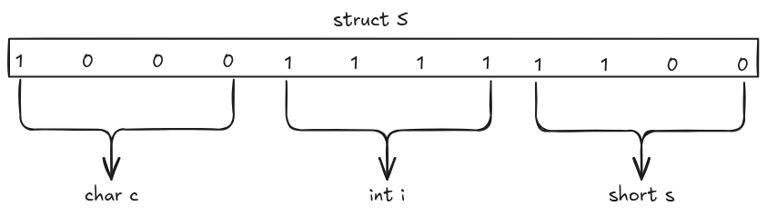

#+title: Data Performance and Caluate
#+author: Hongbin Qu
#+date: <2026-09-08 Tue>
#+hugo_section: zh-cn/cs/org-arch
#+hugo_tags: "computer organization and architecture"
#+hugo_categories: "cs" "org-arch"
#+hugo_custom_front_matter: :logs "数据的表示和计算"
#+hugo_custom_front_matter: :logs_descripe "没时间了，快快学习"

* 数制和编码
** 1. 本章核心框架

计算机中的数据最终都是二进制位串。同一组二进制位可以被解释为无符号整数、补码整数、浮点数、字符或逻辑值，具体含义由数据类型和操作指令决定。

本章应重点掌握：
 1. 二、八、十、十六进制之间的转换。
 2. 原码、反码、补码和移码的表示。
 3. 无符号整数和带符号整数的范围及类型转换。
 4. IEEE 754 单精度、双精度浮点数。
 5. 大端、小端和数据对齐。
 6. 整数加减、乘除与溢出判断。
 7. 浮点数加减、乘除的计算步骤。
 8. CF、OF、SF、ZF 等标志的含义。

---

** 2. 数制和编码
*** 2.1 位串、机器数与真值
 + 真值：数据实际表示的数学值，如 `-5`。
 + 机器数：真值在计算机中的二进制编码。
 + 位串本身没有固定含义，必须结合类型解释。

例如 8 位二进制数：

#+begin_example
1111 1111
#+end_example


不同解释如下：

| 解释方式   |           数值 |
|------------+----------------|
| 无符号整数 |            255 |
| 补码整数   |             -1 |
| 原码整数   |           -127 |
| 逻辑位串   | 8 个二进制状态 |

补码求真值：最高位为 1 是负数，**减 1 取反得到绝对值**

1. 补码： ~11111111~
2. 减 1： ~11111110~
3. 按位取反： ~00000001~ ，绝对值 = 1
  11111111(补码) = -1

*** 注意事项
 - 不要看到最高位为 1 就直接判断为负数。
 - 只有把位串解释为带符号数时，最高位才与符号有关。
 - 进行运算前必须先明确位数、编码方式和有无符号。

---

** 3. 进位记数制转换

*** 3.1 任意进制转十进制

按位权展开：

$\sum_i a_i r^i$

例如：

$(101101.011)_2$

整数部分：

$1\times2^5+0\times2^4+1\times2^3+1\times2^2+0\times2+1  =45$

小数部分：
$0\times2^{-1}+1\times2^{-2}+1\times2^{-3}  =0.375$

所以：
$(101101.011)_2=(45.375)_{10}$

*注意事项*
- 小数点左边的最低位权为 ($r^0$)。
- 小数点右边第一位权为 ($r^{-1}$)，不是 ($r^0$)。
- 展开时不要遗漏数值为 0 的位所对应的位置。

---

*** 3.2 十进制整数转其他进制

使用“除基取余，倒序排列”。

例如把十进制 45 转为二进制：

#+begin_example
45 ÷ 2 = 22 …… 1
22 ÷ 2 = 11 …… 0
11 ÷ 2 =  5 …… 1
 5 ÷ 2 =  2 …… 1
 2 ÷ 2 =  1 …… 0
 1 ÷ 2 =  0 …… 1
#+end_example

余数从下向上排列：
$45_{10} = 101101_{2}$

---

*** 3.3 十进制小数转其他进制

使用“乘基取整，正序排列”。
例如把十进制 `0.625` 转为二进制：

#+begin_example
0.625 × 2 = 1.25   取整数 1
0.25  × 2 = 0.5    取整数 0
0.5   × 2 = 1.0    取整数 1
#+end_example

所以：
$0.625_{10} = 0.101_{2}$

*注意事项*
- 有些十进制小数不能有限地转换成二进制，例如 `0.1`。
- 遇到无限循环时，应根据题目要求保留指定位数并舍入。
- 整数部分和小数部分应分别转换，最后合并。

---

*** 3.4 二进制与八进制、十六进制转换

**** 二进制转八进制以小数点为界
每 3 位分为一组： ~101 101 . 011~

所以：
$101101.011_{2} = 55.3_{8}$

**** 二进制转十六进制

每 4 位分为一组，不足时补 0：

~0010 1101 . 0110~
 
所以：

$101101.011_{2} = 2D.6_{16}$

*注意事项*
- 整数部分从小数点向左分组。
- 小数部分从小数点向右分组。
- 补 0 只能补在整数部分左侧或小数部分右侧，不能改变数值。

---

** 4. 定点数的编码

假设机器字长为 (n) 位，其中最高位与符号有关。
**** 4.1 原码
表示方法：
 - 正数：符号位为 0，数值部分为绝对值。
 - 负数：符号位为 1，数值部分仍为绝对值。

以 8 位整数为例：

#+begin_example
[+5]原 = 0000 0101
[-5]原 = 1000 0101
#+end_example

范围：

$-(2^{n-1}-1)\sim +(2^{n-1}-1)$

 *特点*
 - 表示直观。
 - 存在 ~+0~ 和 ~-0~
 - 加减运算不方便。

---

**** 4.2 反码
 - 正数反码与原码相同。
 - 负数反码： *符号位* 不变，数值位逐位取反。

#+begin_example
[-5]原 = 1000 0101
[-5]反 = 1111 1010
#+end_example

*特点*
- 同样存在 ~+0~ 和 ~-0~
- 主要用于帮助理解补码。

---

**** 4.3 补码
- 正数补码与原码相同。
- 负数补码：原码数值位取反后加 1。
- 也可将负数对应正数的全部二进制位取反加 1。
    
#+begin_example
[+5]补 = 0000 0101
[-5]补 = 1111 1011
#+end_example

快速求负数补码：

#+begin_example
+5：0000 0101
取反：1111 1010
加1 ：1111 1011
#+end_example

n 位补码整数范围：

$-2^{n-1}\sim 2^{n-1}-1$

8 位补码范围：

#+begin_example
-128～127
#+end_example

*** 补码转真值

若最高位为 0，直接按无符号数计算。
若最高位为 1，可以：
1. 对补码取反；
2. 加 1；
3. 得到绝对值；
4. 添加负号;

例如：

#+begin_example
1110 0111
取反：0001 1000
加1 ：0001 1001 = 25
#+end_example

所以真值为 ~-25~
也可以直接按权展开：

$x=-b_{n-1}2^{n-1}+\sum_{i=0}^{n-2}b_i2^i$

*特别注意*

最小负数没有对应的同宽正数：

#+begin_example
1000 0000₂ = -128
#+end_example

8 位补码中不能表示 ~+128~

因此，对最小负数求绝对值可能溢出。

---

**** 4.4 移码

移码常用于表示浮点数的阶码。

若偏置值为 (Bias)，则：$移码=真值+Bias$

IEEE 754 中：
 - 单精度偏置值为 127。
 - 双精度偏置值为 1023。

例如单精度实际指数为 3：$E=3+127=130=10000010_2$

*注意事项*
 - 移码便于按无符号数比较指数大小。
 - 不能把阶码字段直接当作实际指数。
 - IEEE 754 的全 0 和全 1 阶码有特殊用途。

---

**** 4.5 四种编码比较

| 编码 | 正数               | 负数               | 零的数量 | 主要用途             |
|------+--------------------+--------------------+----------+----------------------|
| 原码 | 符号位 0，数值不变 | 符号位 1，数值不变 |        2 | 教学、符号与数值分离 |
| 反码 | 与原码相同         | 数值位取反         |        2 | 理解补码             |
| 补码 | 与原码相同         | 取反加 1           |        1 | 带符号整数           |
| 移码 | 真值加偏置         | 真值加偏置         |        1 | 浮点数阶码           |

---

** 5. 整数的表示

*** 5.1 无符号整数

n 位无符号整数范围：

$0\sim2^n-1$

例如 8 位无符号整数：

#+begin_example
0000 0000 = 0
1111 1111 = 255
#+end_example


无符号运算按模 ($2^n$) 进行。

例如 8 位运算：

#+begin_example
255 + 1 = 0
#+end_example


因为数学结果 256 被截断为低 8 位。

---

*** 5.2 带符号整数

现代计算机一般使用补码表示带符号整数。
n 位补码范围：$-2^{n-1}\sim2^{n-1}-1$

| 位数 |      最小值 |     最大值 |
|    8 |        -128 |        127 |
|   16 |      -32768 |      32767 |
|   32 | -2147483648 | 2147483647 |

*注意事项*
- 补码负数范围比正数多一个数。
- 不能仅根据最终位串判断是否溢出，必须结合运算类型。
- 相同位串在有符号和无符号解释下可能完全不同。

---

*** 5.3 扩展与截断

***** 零扩展
无符号数扩大位数时，高位补 0。

#+begin_example
8位：1111 0001
16位：0000 0000 1111 0001
#+end_example

***** 符号扩展
补码带符号数扩大位数时，高位复制原符号位。

#+begin_example
8位：1111 0001
16位：1111 1111 1111 0001
#+end_example

其真值保持不变。
***** 截断
缩短位数时，只保留低位。

#+begin_example
32位数 → 16位数
保留最低16位
#+end_example

*注意事项*
- 无符号数用零扩展。
- 补码有符号数用符号扩展。
- 截断可能改变数值，甚至改变符号。
- 先扩展还是先运算可能影响结果。

---

*** 5.4 C 语言整数转换

***** 较小整数类型参与运算
~char~ 、 ~short~ 通常先进行整型提升，再参与运算。
***** 有符号数与无符号数混合

在相同位宽下，有符号数通常会转换为无符号数。

例如 32 位环境：

#+begin_example
-1 < 1U
#+end_example

~-1~ 转换为：

#+begin_example
[-1]原 = 1000 0000 0000 0000 0000 0000 0000 0001
[-1]反 = 1111 1111 1111 1111 1111 1111 1111 1110
[-1]补 = 1111 1111 1111 1111 1111 1111 1111 1111
#+end_example
$2^{32} - 1 = 4294967296 - 1$,因此表达式结果为假.

***** 典型陷阱

#+begin_src C
unsigned len = 0;

for (int i = 0; i <= len - 1; i++) {
    ...
}
#+end_src

~len - 1~ 不会得到 ~-1~ ，而会得到最大无符号数，循环可能越界。

正确方式：

#+begin_src C
for (unsigned i = 0; i < len; i++) {
    ...
}
#+end_src

*注意事项* 
- 比较前先确定表达式最终采用有符号还是无符号运算。
- 无符号下溢和上溢都会按模回绕。
- C 语言的有符号溢出通常属于未定义行为，不能依赖其回绕结果。
- 长度、数组下标和返回值混合时尤其要注意符号性。

---

** 6. 实数与 IEEE 754 浮点数

*** 6.1 浮点数的一般形式

浮点数通常表示为：$(-1)^S\times M\times 2^E$
其中：
 - (Sign)：符号。
 - (Mantissa)：尾数或有效数
 - (Exponent)：实际指数。

浮点数的特点：
- 阶码位数主要决定表示范围。
- 尾数字段位数主要决定精度。
- 浮点数通常只能近似表示实数。

---

*** 6.2 IEEE 754 格式

| 格式          | 总位数 | 符号位(S) | 阶码位($2^E$) | 尾数字段(M) | 偏置值(Bias) |
| 单精度 float  |     32 |      1 |      8 |       23 |    127 |
| 双精度 double |     64 |      1 |     11 |       52 |   1023 |

对于规格化数：$数值=(-1)^S\times(1.F)_2\times2^{E-Bias}$

其中$(1.F)_2$最高有效位 ~1~ 不实际保存，称为隐藏位。

---

*** 6.3 阶码分类

| 阶码               | 尾数字段 | 表示对象       |
| 全 0               | 全 0     | 正零或负零     |
| 全 0               | 非 0     | 非规格化数     |
| 既非全 0，也非全 1 | 任意     | 规格化数       |
| 全 1               | 全 0     | 正无穷或负无穷 |
| 全 1               | 非 0     | NaN            |

**** 规格化数

$(-1)^S\times(1.F)_2\times2^{E-Bias}$

**** 非规格化数
$(-1)^S\times(0.F)_2\times2^{1-Bias}$

注意：非规格化数的实际指数固定为 ~1-Bias~ ，不是 ~0-Bias~

---

*** 6.4 十进制数转 IEEE 754

以 ~-13.25~ 的单精度表示为例。
***** 第一步：确定符号位
负数：

$$S = 1$$

***** 第二步：把绝对值转成二进制

$$13.25_{10} = 1101.01_{2}$$

***** 第三步：规格化

$$1101.01_{2} = 1.10101_{2} × 2^{3}$$

所以实际指数为：

$$e = 3$$

***** 第四步：求阶码字段

$$E = e + 127 = 130 = 10000010_{2}$$

***** 第五步：填写尾数字段
去掉隐藏的整数位 ~1~ ：

$$F = 10101000000000000000000$$

***** 第六步：组合

$$1 | 10000010 | 10101000000000000000000$$

按 4 位分组：

$$1100 | 0001 | 0101 | 0100 | 0000 | 0000 | 0000 | 0000$$

十六进制结果：

$$C1540000H$$

---

*** 6.5 IEEE 754 转十进制

一般步骤：
1. 拆分符号位、阶码和尾数字段。
2. 判断属于零、非规格化数、规格化数、无穷还是 NaN。
3. 规格化数实际指数为：$e=E-Bias$
4. 尾数为：$M=(1.F)_2$
5. 代入：$(-1)^S\times M\times2^e$
***** 注意事项
- 先判断阶码是否全 0 或全 1。
- 只有规格化数具有隐藏位 ~1~
- 非规格化数的隐藏位是 ~0~
- 不要把阶码字段直接当实际指数。

---
*** 6.6 浮点数表示中的精度问题

十进制 ~0.1~ 不能用有限二进制小数精确表示，因此：
```
0.1 + 0.2 == 0.3
```
在某些情况下可能为假。
***** 注意事项
- 浮点数是有限精度近似值。
- 两个浮点结果通常不能简单使用 ~==~ 比较。
- 可根据问题选择绝对误差或相对误差判断。
- 浮点数越大，相邻可表示数之间的间隔通常越大。
- 大数加很小的数，小数可能完全丢失。

*** 练习
1. ~float~ 和 ~double~ 区别（位数、bias、精度、范围）
2. 为什么 ~0.1+0.2≠0.3~
3. NaN 的特性： ~NaN != NaN~
4. +0 和 -0 的区别
5. 非规格化数的作用
---
** 7. 非数值数据表示

*** 7.1 逻辑数据
一般规定：
- 0 表示假。
- 非 0 表示真。
需要区分：
#+begin_example
逻辑与：&&
按位与：&
逻辑或：||
按位或：|
逻辑非：!
按位取反：~
#+end_example
***** 注意事项
- 逻辑运算的结果通常规范为 0 或 1。
- 按位运算逐位处理，结果不一定只有 0 或 1。
- ~&&~ 和 ~||~ 通常具有短路求值特性。

---

*** 7.2 字符编码
- ASCII 使用 7 位编码基本英文字符。
- 数字字符 ~'0'~ 的编码与整数 0 不相同。
- 汉字处理可能涉及输入码、机内码和字形码。
- 当代系统一般使用 Unicode，常见编码形式为 UTF-8。

***** 注意事项
- 字符编码值和字符表示的数值不是一回事。
- UTF-8 是变长编码，字符数不一定等于字节数。
- 文件中的字节必须结合字符编码才能正确解释。

---

** 8. 数据宽度、单位与排列

*** 8.1 常用单位

- 1 Byte = 8 bit
- 1 KiB = $2^{10}$ Byte
- 1 MiB = $2^{20}$ Byte
- 1 GiB = $2^{30}$ Byte
- 1 TiB = $2^{40}$ Byte
十进制单位：

- 1 KB = $10^{3}$ Byte
- 1 MB = $10^{6}$ Byte
- 1 GB = $10^{9}$ Byte
***** 注意事项
- 教材计算题若写 ~KB~ ，应根据题目语境判断按 ($2^{10}$) 还是 ($10^3$) 计算。
- 内存容量通常按二进制单位理解。
- 磁盘厂商标称容量通常使用十进制单位。
- bit 和 Byte 不可混淆，注意大小写 ~b~ 与 ~B~

---

*** 8.2 大端和小端
假设 32 位数据：

~0x12345678~ 从地址 ~1000H~ 开始存放。

\(0x12345678
= \underbrace{0x12}_{byte3}\!\times2^{24}
+\underbrace{0x34}_{byte2}\!\times2^{16}
+\underbrace{0x56}_{byte1}\!\times2^{8}
+\underbrace{0x78}_{byte0}\!\times2^{0}\)

[[#move-bits][算术移位运算
]]
***** 大端方式
低地址存放最高(数值权重)有效字节：

| 地址  | 内容 |
| 1000H | 12H  |
| 1001H | 34H  |
| 1002H | 56H  |
| 1003H | 78H  |

***** 小端方式
低地址存放最低(数值权重)有效字节：

| 地址  | 内容 |
| 1000H | 78H  |
| 1001H | 56H  |
| 1002H | 34H  |
| 1003H | 12H  |

***** 注意事项
- 字节序只影响多字节数据中各字节的排列。 
- 单个字节没有大端、小端之分。
- 字节内部的位序不能按字节序倒置。
- x86/x86-64 通常使用小端。
- 网络字节序通常使用大端。
- 写内存内容时先按字节拆分，再按字节序排列。  

---

*** 8.3 数据对齐

若某数据类型的对齐要求为 (a)，通常要求其首地址满足：
地址$\bmod a=0$

结构体中可能存在：
- 成员之间的内部填充。
- 最后一个成员之后的尾部填充。

结构体大小通常是最大成员对齐值的整数倍。
***** 结构体计算步骤
1. 从偏移 0 开始。
2. 每个成员放到满足自身对齐要求的最小偏移处。
3. 必要时在前一个成员后插入填充。
4. 所有成员放完后，将总大小补到最大对齐值的整数倍。

例如假设：
- ~char~ ：大小 1，对齐 1。
- ~int~ ：大小 4，对齐 4。
- ~short~ ：大小 2，对齐 2。

#+begin_src 
struct S {
    char  c;
    int   i;
    short s;
};
#+end_src

布局：

| 成员或填充 | 偏移    | 大小  |
| ~c~   | 0     | 1   |
| 填充    | 1～3   | 3   |
| ~i~   | 4～7   | 4   |
| ~s~   | 8～9   | 2   |
| 尾部填充  | 10～11 | 2   |


1表示各类型占据字节大小，0表示填充。
所以：
sizeof(struct S) = 12

***** 注意事项
- 结构体大小不能简单等于各成员大小之和。
- 成员声明顺序会影响结构体大小。
- 数组中的每个结构体元素也必须保持正确对齐，因此需要尾部填充。
- 联合体大小至少等于最大成员大小，并补齐到最大对齐要求的整数倍。
- 实际规则以目标平台 ABI 和编译器设置为准。

---

** 9. 整数加减运算

*** 9.1 补码加法

n 位补码加法步骤：
1. 将两个操作数表示为相同位数的补码。
2. 包括符号位在内直接相加。
3. 丢弃最高位之外的进位。
4. 根据 OF 判断带符号结果是否溢出。
5. 根据 CF 判断无符号结果是否产生进位。

例如 8 位：

#+begin_example
  0000 0101   (+5)
+ 1111 1101   (-3)
------------
1 0000 0010
#+end_example

舍弃最高进位：

0000 0010 = 2

---

*** 9.2 补码减法

利用：
$x-y=x+(-y)$

计算步骤：
1. 求 ~y~ 的补码相反数：按位取反加 1。
2. 执行补码加法。
3. 保留低 n 位。
4. 判断溢出和借位。

例如：

#+begin_example
5 - 3 = 5 + (-3)
#+end_example

---

*** 9.3 CF 与 OF
***** CF：进位标志
用于判断无符号运算。
- 无符号加法产生最高位进位时，CF 为 1。
- 在 x86 式减法中，发生无符号借位时，CF 为 1。

***** OF：溢出标志
用于判断带符号补码运算。
加法溢出规律：
- 两个正数相加得到负数：溢出。
- 两个负数相加得到非负数：溢出。
- 异号数相加：不会产生带符号溢出。

减法溢出规律：
- 两操作数异号；
- 且结果符号与被减数符号不同。

***** 重要区别
同一次运算可能：
- CF=1、OF=0；
- CF=0、OF=1；
- 两者都为 1；
- 两者都为 0。

原因是 CF 和 OF 分别服务于无符号解释和带符号解释。

---

*** 9.4 SF 与 ZF
- SF：结果的最高位，即符号标志。
- ZF：结果是否全部为 0。

***** 注意事项
- SF=1 不等于一定得到合法负数；若发生 OF，截断结果已不能代表数学结果。
- ZF 只判断结果位串是否为 0。
- 判断大小时，需要结合有无符号类型选择对应标志。

---

*** 9.5 加减法溢出判断

***** 无符号加法

若：
$x+y\ge2^n$
则溢出。

也可判断结果：
#+begin_example
result < x
#+end_example
***** 带符号加法
只在同号数相加时可能溢出：

#+begin_example
正 + 正 → 负：溢出
负 + 负 → 非负：溢出
#+end_example
***** 带符号减法
只有被减数和减数异号时可能溢出：

#+begin_example
正 - 负 → 负：溢出
负 - 正 → 非负：溢出
#+end_example

***** 注意事项
- 先明确是无符号运算还是带符号运算。
- 不能用 CF 判断带符号溢出。
- 不能用 OF 判断无符号溢出。
- 不能只看十进制结果符号，必须考虑固定位数范围。


例子

为了方便演示，我们统一使用 8位二进制补码 进行计算。在8位补码中，能表示的有符号数范围是 -128 到 +127。

例题 1：正数 + 负数（无溢出）
题目：计算 (+5) + (-3)，并求出 CF, OF, SF, ZF。

1. 转换为补码：
[+5] 原/补：0000 0101

[-3]原：1000 0011 -> [-3]反：1111 1100 -> [-3]补：1111 1101

2. 补码加法运算：
 
#+begin_example
  0000 0101  (+5的补码)
+ 1111 1101  (-3的补码)
----------------
1 0000 0010  (最高位的1是进位，丢弃)
#+end_example

结果为： 0000 0010 （即十进制的 +2，结果正确）

标志位判断

- CF (进位)：最高有效位向外有进位 1，所以 CF =1。（注意：CF对无符号数有意义，这里仅看硬件状态）
- OF (溢出)：正数加负数，绝对不会溢出，所以 OF = 0。（也可以用进位判断法：次高位向符号位进位 C_n=1，符号位向外进位 C_f=1，1 oplus 1 = 0，无溢出）
- SF (符号)：结果最高位是 0，所以 SF = 0。
- ZF (零)：结果不为0，所以 ZF = 0。

例题 2：正数 + 正数（正溢出 / 上溢）
题目：计算 (+120) + (+10)，并求出 CF, OF, SF, ZF。

1. 转换为补码
[+120] 的补码：0111 1000

[+10]  的补码：0000 1010

2. 补码加法运算：
#+begin_example
  0111 1000  (+120的补码)
+ 0000 1010  (+10的补码)
---------------
  1000 0010  (最高位没有向外进位)
#+end_example

结果为： 1000 0010 （如果当成有符号数看，最高位是1，变成了负数 -126，这显然是错的！）

标志位判断：
- CF (进位)：最高位没有向外进位，所以 CF = 0。
- OF (溢出)：正数加正数，结果符号位变成了 1（负数），符号改变，发生正溢出，所以 OF = 1。
- SF (符号)：结果最高位是 1，所以 SF = 1。
- ZF (零)：结果不为0，所以 ZF = 0。

例题 3：负数 + 负数（负溢出 / 下溢）
题目：计算 (-100) + (-50)，并求出 CF, OF, SF, ZF。

1. 转换为补码：
[-100]原 1110 0100 -> [-100]反 1001 1011 -> [-100]补 1001 1100

[-50]原 1011 0010 -> [-50]反 1100 1101 -> [-50]补 1100 1110

2. 补码加法运算：
#+begin_example
  1001 1100  (-100的补码)
+ 1100 1110  (-50的补码)
---------------------
1 0110 1010  (最高位的1是进位，丢弃)
#+end_example

结果为： 0110 1010 （如果当成有符号数看，最高位是0，变成了正数 +106，这显然是错的！）

3. 标志位判断：
- CF (进位)：最高位向外有进位 1，所以 CF = 1。
- OF (溢出)：负数加负数，结果符号位变成了 0（正数），符号改变，发生负溢出，所以 OF = 1。
- SF (符号)：结果最高位是 0，所以 SF = 0。
- ZF (零)：结果不为0，所以 ZF = 0。

💡 核心总结与考试避坑指南：

- 判断有符号数是否溢出，只看 OF！ OF=1 就是溢出了，结果就是错的。
- CF 和 OF 经常是“反着来”的（如例题2和3），但这并不是绝对规律。比如例题1中，CF=1 但 OF=0。
- SF 在溢出时是不可信的。比如例题3中，两个负数相加，结果 SF=0（看起来像正数），这就是因为发生了溢出导致符号位“翻转”了。

你可以拿张纸，自己试着算一下 (-5) + (-5) 或者 (+100) + (+50)，看看标志位是不是和你想的一样！如果还有哪里觉得绕，随时告诉我。

*** 双符号位判断溢出

双符号位判断法（又称 **变形补码** 或 **模4补码** ）是计算机组成原理中用于检测有符号数加减运算是否溢出的一种高效方法。它通过增加一个符号位，让硬件电路能更直观地识别溢出情况。

以下是该方法的详细解析：

1. 核心规则
在双符号位机制下，正数的符号位表示为 ~00~ ，负数的符号位表示为 ~11~ 。运算时，这两个符号位与数值位一起参与运算，最高符号位产生的进位直接丢弃。

运算结束后，通过观察结果的两个符号位来判断状态：
+ 无溢出：若结果的两个符号位相同（即 ~00~ 或 ~11~ ），则表示运算结果没有溢出。其中 ~00~ 代表结果为正， ~11~ 代表结果为负。
+ 发生溢出 ：若结果的两个符号位不同（即 ~01~ 或 ~10~ ），则表示运算发生了溢出。
+ ~01~ 表示正溢出（上溢) ：说明两个正数相加（或正数减去负数）的结果超出了机器能表示的最大正数范围。
+ ~10~ 表示负溢出（下溢）：说明两个负数相加（或负数减去正数）的结果超出了机器能表示的最小负数范围。

2. 关键特性
不论运算是否发生溢出，*高位符号位（即左边第一位）始终代表正确的符号* 。例如，当结果符号位为 ~01~ 时，高位是 ~0~ ，说明结果本应是正数，只是发生了正溢出；当结果符号位为 ~10~ 时，高位是 ~1~ ，说明结果本应是负数，只是发生了负溢出。

3. 具体示例演示
假设我们使用包含双符号位的变形补码进行加法运算：

正溢出（上溢）示例：
    计算两个正数相加，例如 ~+120~ 和 ~+10~ 。
    在变形补码下，它们分别表示为 ~00 1111000~ 和 ~00 0001010~ 。
    相加后得到：

#+begin_example
      00 1111000
    + 00 0001010
    ------------
      01 0000010
#+end_example

    结果的符号位为 ~01~，高位是 ~0~ （正），低位是 ~1~ （溢出），这明确指示发生了 **正溢出（上溢）** 。

负溢出（下溢）示例：
    计算两个负数相加，例如 ~-100~ 和 ~-50~。
    在变形补码下，它们分别表示为 ~11 0011100~ 和 ~11 1001110~ 。
    相加后得到：

#+begin_example
      11 0011100
    + 11 1001110
    ------------
    1 10 1110100  (最高位的进位1丢弃)
#+end_example

    结果的符号位为 ~10~ ，高位是 ~1~ （负），低位是 ~0~ （溢出），这明确指示发生了 **负溢出（下溢）** 。

这种方法在硬件实现上非常高效，只需一个异或门比较两个符号位是否一致即可得出溢出标志（OF），是CPU算术逻辑单元（ALU）中常用的溢出检测机制。

---

** 10. 移位运算

*** 10.1 逻辑移位

空出的位补 0，主要用于无符号数。
- 逻辑左移：低位补 0。
- 逻辑右移：高位补 0。
若没有溢出，无符号左移 k 位相当于：$x\times2^k$
无符号右移 k 位相当于：$\left\lfloor\frac{x}{2^k}\right\rfloor$

---
*** 10.2 算术移位
:PROPERTIES:
:CUSTOM_ID: move-bits
:END:
主要用于补码带符号数。
- 算术左移：低位补 0。
- 算术右移：高位复制符号位。

算术右移负数通常向负无穷方向舍入。
例如：

#+begin_example
-5 >> 1 = -3
#+end_example

但 C 整数除法向 0 取整：

#+begin_example
-5 / 2 = -2
#+end_example

所以负数的算术右移不能在所有情况下直接代替除法。
若需要用算术右移实现向 0 取整的除以 ($2^k$)，可先修正：
$(x+(x<0?2^{k}-1:0))>>k$

***** 注意事项
- 左移可能丢失高位并溢出。
- 带符号负数的移位在语言层面可能受语言标准和实现约束。
- “乘除以 2 的幂可以换成移位”必须检查符号、溢出和舍入方向。
- 移位位数不能非法地大于或等于操作数宽度。

---

** 11. 定点数乘法

教材中的核心思想是移位与加减，不需要死记复杂电路。
*** 11.1 无符号乘法
二进制乘法与十进制竖式类似。
对于乘数的每一位：
- 当前位为 1：加入相应左移后的被乘数。
- 当前位为 0：不加入。
- 最后将各部分积相加。

例如：

#+begin_example
      1011   (11)
×     0101   (5)
-----------
      1011
     0000
    1011
+  0000
-----------
   110111    (55)
#+end_example

***** 计算步骤
1. 从乘数最低位开始检查。
2. 若该位为 1，将被乘数左移相应位数后累加。
3. 若该位为 0，跳过。
4. 保留足够位数存放完整乘积。

***** 溢出判断
两个 n 位数的完整乘积最多需要 2n 位。
若只保留 n 位：
- 无符号乘法：高 n 位非 0，说明溢出。
- 补码乘法：高 n 位不是低 n 位符号位的扩展，说明溢出。

---

*** 11.2 原码乘法

基本方法：
1. 结果符号为两个操作数符号的异或。
2. 绝对值部分按无符号乘法计算。
3. 将符号与数值部分组合。

***** 注意事项
- 符号位不参与数值部分乘法。
- 应先计算足够宽的完整乘积，再判断能否放入目标位宽。
    

---

*** 11.3 补码乘法

补码乘法允许符号位参与编码运算。理解时应抓住：

- 补码最高位具有负权。
- 计算结果仍应使用 2n 位补码保存完整乘积。
- Booth 类方法可将连续的 1 转换成较少的加减操作。

***** 注意事项
- 不建议只把两个负数的补码按普通无符号数相乘后截断，再直接解释。
- 应明确题目使用的是完整 2n 位乘积还是截断后的 n 位结果。
- 判断溢出时必须检查被丢弃的高位。

---
*** 11.4 乘常数优化
整数乘以 ($2^k$) 可转换为左移：
$x\times2^k=x<<k$
其他常数可以转换为移位与加减。
例如：
$x\times10=x\times(8+2)=(x<<3)+(x<<1)$
$x\times7=x\times(8-1)=(x<<3)-x$
***** 注意事项
- 转换后的运算仍可能溢出。
- C 语言带符号溢出具有特殊语义，不能无条件替换。
- 现代编译器通常会自动完成这类优化。

---
** 12. 定点数除法

*** 12.1 无符号除法
二进制除法类似十进制长除法。
基本步骤：
1. 将被除数高位部分与除数比较。
2. 若部分余数不小于除数，则减去除数，对应商位置 1。
3. 若小于除数，对应商位置 0。
4. 移入下一位，继续比较。
5. 最终得到商和余数。

应满足：
$被除数=除数\times商+余数$

并且：
$0\le余数<除数$

---

*** 12.2 带符号除法

通常：
- 商的符号由被除数和除数符号异或决定。
- 余数的符号通常与被除数一致。
- C 语言整数除法向 0 取整。

例如：
#+begin_example
-7 / 3 = -2
-7 % 3 = -1
#+end_example

验证：
#+begin_example
-7 = 3 × (-2) + (-1)
#+end_example

---
*** 12.3 除法的特殊情况
***** 除数为 0
不能进行除法，通常产生异常。

***** 最小负数除以 -1
以 8 位补码为例：
#+begin_example
-128 / -1 = 128
#+end_example

但 8 位补码最大值是 127，因此溢出。
***** 商溢出
即使除数不为 0，商也可能无法放入指定宽度。

***** 注意事项
- 必须检查除数是否为 0。
- 必须单独检查 ~MIN / -1~。
- 余数不是任意值，应满足绝对值小于除数绝对值。
- 负数除法的舍入方向要依据语言或题目规定。

---
** 13. 浮点数加减运算
浮点加减一般分为五步：
1. 对阶。
2. 尾数加减。
3. 规格化。
4. 舍入。
5. 判断溢出或特殊结果。

*** 13.1 对阶
将指数较小的数向指数较大的数对齐。

方法：
- 小阶向大阶看齐。
- 较小阶数的尾数右移。
- 每右移一位，阶码加 1。

例如：
$1.01\times2^5+1.10\times2^3$

第二个数对阶：
$0.0110\times2^5$

然后计算：
$1.0100\times2^5+0.0110\times2^5$

***** 为什么小阶向大阶对齐?
尾数右移只会损失低位；若大阶向小阶对齐，需要左移大数尾数，可能丢失高位或无法表示。

---

*** 13.2 尾数加减

阶码相同后，直接对尾数进行加法或减法。
- 同号数相加：尾数相加。
- 异号数相加：绝对值较大的尾数减去较小的尾数。
- 减法可转化为加上相反数。

---

*** 13.3 规格化
***** 右规
若尾数相加后产生进位：

#+begin_example
10.xxxx
#+end_example

则尾数右移一位，阶码加 1。

***** 左规
若相减后前导 0 过多：
#+begin_example
0.001xxx
#+end_example

则尾数左移，直到恢复规格化，同时阶码相应减小。

***** 注意事项
- 右规可能导致阶码上溢。 
- 左规可能导致阶码下溢。
- 两个数很接近且符号相反时，可能出现严重的有效数字消失，称为大数吃小数或相消误差中的灾难性抵消。

---

*** 13.4 附加位
在对阶和运算过程中，通常保留：
- Guard bit：保护位。
- Round bit：舍入位。
- Sticky bit：粘滞位。

粘滞位表示其后的所有被丢弃位中是否至少存在一个 1。
这些附加位用于提高最终舍入的准确性。

---

*** 13.5 舍入方式

IEEE 754 常见舍入模式：
1. 向最接近值舍入，遇到中间值取偶数。
2. 向正无穷舍入。
3. 向负无穷舍入。
4. 向 0 舍入。

默认通常是“就近舍入， ties to even”。
***** 就近舍入取偶
如果恰好处于两个可表示数的正中间，则选择最低保留位为 0 的结果。
这样可以降低大量运算中始终向同一方向舍入造成的统计偏差。

---

*** 13.6 浮点加减注意事项

- 浮点加法不满足严格结合律：$(a+b)+c\ne a+(b+c)$
- 小数与大数相加，小数可能在对阶时完全丢失。
- 两个相近数相减可能丢失大量有效数字。
- 运算过程中不能过早截断，应保留附加位。
- 必须在规格化后进行最终舍入。
- 阶码上溢通常得到无穷大或最大有限数，取决于舍入模式。
- 阶码下溢可能得到非规格化数或零。
- NaN 参与多数运算后结果仍为 NaN。

---

# 14. 浮点数乘除运算

** 14.1 浮点乘法
对于：
$X=(-1)^{S_x}M_x2^{E_x}$
$Y=(-1)^{S_y}M_y2^{E_y}$

乘积：
$(-1)^{S_x\oplus S_y}  (M_xM_y)  2^{E_x+E_y}$

***** 计算步骤
1. 符号位异或。
2. 实际指数相加。
3. 尾数相乘。
4. 对结果规格化。
5. 舍入。
6. 判断阶码上溢、下溢及特殊值。

若直接对 IEEE 阶码字段计算：$E_{结果}=E_x+E_y-Bias$
因为两个阶码字段中各包含一次偏置。

---

*** 14.2 浮点除法

商为：

$(-1)^{S_x\oplus S_y}\left(\frac{M_x}{M_y}\right) 2^{E_x-E_y}$

***** 计算步骤

1. 符号位异或。
2. 实际指数相减
3. 尾数相除。
4. 规格化。
5. 舍入。
6. 判断溢出及特殊值。

若使用 IEEE 阶码字段：$E_{结果}=E_x-E_y+Bias$

---

*** 14.3 浮点乘除特殊结果

| 运算        | 典型结果     |
| --------- | -------- |
| 有限非零数 ÷ 0 | 带符号无穷大   |
| 0 ÷ 0     | NaN      |
| ∞ ÷ ∞     | NaN      |
| 0 × ∞     | NaN      |
| 有限数 × ∞   | 带符号无穷大   |
| NaN 参与运算  | 通常仍为 NaN |

***** 注意事项
- 不能只对存储的阶码字段直接相加或相减而忘记偏置修正。
- 尾数运算后必须重新规格化。
- 最终结果需要舍入，不能无限保留尾数。
- 特殊值应在普通计算前单独判断。
- 浮点乘除的数学结果正确，不代表目标格式一定能表示。

---

** 15. 本章重点公式速查

***** 无符号整数范围
$0\sim2^n-1$

***** 补码整数范围
$-2^{n-1}\sim2^{n-1}-1$

***** 补码按权展开
$x=-b_{n-1}2^{n-1}+\sum_{i=0}^{n-2}b_i2^i$

***** IEEE 754 规格化数
$(-1)^S\times(1.F)_2\times2^{E-Bias}$

***** IEEE 754 非规格化数
$(-1)^S\times(0.F)_2\times2^{1-Bias}$

***** 单精度参数

#+begin_example
符号位：1位
阶码：8位
尾数字段：23位
Bias：127
#+end_example

***** 双精度参数

#+begin_example
符号位：1位
阶码：11位
尾数字段：52位
Bias：1023
#+end_example

***** 浮点乘法阶码字段
$E_z=E_x+E_y-Bias$

***** 浮点除法阶码字段
$E_z=E_x-E_y+Bias$

***** 平均记忆口诀

#+begin_example
整数转进制：除基取余，倒序排列
小数转进制：乘基取整，正序排列
负数求补码：取反加一
补码求负值：取反加一，再加负号
浮点加减：对阶、运算、规格化、舍入、判溢出
浮点乘法：符号异或、阶码相加、尾数相乘
浮点除法：符号异或、阶码相减、尾数相除
#+end_example

---

** 16. 考试高频易错点

1. 把位串最高位为 1 一律解释成负数。
2. 混淆原码、反码、补码和移码。
3. 忘记补码最小负数没有对应的同宽正数。
4. 计算补码加法后保留了超出字长的进位。
5. 使用 CF 判断带符号溢出，或使用 OF 判断无符号溢出。
6. 忽略 C 表达式中的无符号类型转换。
7. 将无符号数 ~0-1~ 误认为得到负数。
8. 符号扩展时错误地在高位补 0。
9. 二进制转十六进制时从错误方向分组。
10. 大端、小端排列时把一个字节内部的位也倒序。
11. 计算结构体大小时遗漏内部或尾部填充。
12. IEEE 754 转换时忘记隐藏位。
13. 把存储阶码直接当实际指数。
14. 对非规格化数错误地补隐藏位 1。
15. 对阶时把大阶向小阶对齐。
16. 浮点运算中未保留保护位、舍入位和粘滞位。
17. 认为浮点加法满足严格结合律。
18. 认为十进制小数都能用有限二进制精确表示。
19. 认为负数右移一定等价于除以 2 的幂。
20. 乘法只看低位结果，不检查被截断的高位。
21. 忘记检查除数为 0。
22. 忘记 ~最小负数/-1~ 会产生溢出。
23. 浮点乘除直接对阶码字段加减，忘记修正 Bias。
24. 混淆 ~bit~、~Byte~、~KB~ 和 ~KiB~ 。

---

** 17. 推荐解题顺序

遇到数据表示与运算题时，统一按以下顺序处理：

1. 写明机器字长。
2. 写明数据类型：无符号、补码还是浮点数。
3. 确定运算前是否发生类型转换。
4. 将操作数写成相同宽度的机器数。
5. 按规定方法运算。
6. 严格截断到目标宽度。
7. 判断 CF、OF、SF、ZF 或浮点异常。
8. 将结果按题目要求解释成真值或十六进制。
9. 最后检查是否存在溢出、精度损失或特殊值。

最重要的原则是：

> **先确定位数和解释方式，再计算；先得到机器结果，再判断它能否代表数学结果。**


