:PROPERTIES:
:ID:       20260904T161001
:END:

#+title: operating-system
#+hugo_section: en/os
#+hugo_tags: OSTEP
#+hugo_categories: "Operating System"
#+hugo_custom_front_matter: :logs "according to operating system - three easy pices"
#+hugo_custom_front_matter: :logs_descripe "I am write the blogs for a few months. In the time, I have gave up and losted enthusiasm many times"

* Process
:PROPERTIES:
:ROAM_ALIASES: OS process
#+STARTUP: align
:ID:       84dc9817-d304-46ce-b33f-273bfeee4f09
:END:
n- A basic resources unit which is assigned with memory in OS
- Has isolated memory address

* Thread
:PROPERTIES:
:ID:       4d306248-c201-4184-991b-f0f69de4b946
:ROAM_ALIASES: thread
:END:

- A basic unit is called by CPU
- rely on and within [[Process]]

* coroutine
:PROPERTIES:
:ROAM_ALIASES: coroutine
:ID:       3acc4521-f68f-4266-8324-0c4de538f9b5
:END:
-

| *dimension*                      | *Process*                              | *thread*                                 | *coroutine*                               |
| *caller*                         | os's kernel                            | os's kernel                              | user program                              |
| *memory space*                   | Individual(no shared)                  | share with Memory of Process             | share with Memory of Proces               |
| *switching performance overhead* | very high (us-ms)                      | middle(us)                               | low(ns)                                   |
| *parallel*                       | hundreds of concurrent cons            | Several thousand up to tens of thousands | hundreds of thousands to millions         |
| *concurrent ability*             | multicore                              | multicore                                | concurrent within singal thread           |
| *usage*                          | sandbox, dense scenario of CPU-process | Web service, dense scenario I/O          | high-concurrent gateway,async web crawler |

[[file:memory_alignment.excalidraw]]

Memory Alignment means:
- the memory address where is stored by values is multiple of its value's bytes

* stack and heap                                                     :ATTACH:
:PROPERTIES:
:ROAM_ALIASES: stack heap
:ID:       ec82f92c-b04b-4f3e-a00c-dfe5b21563e0
:END:
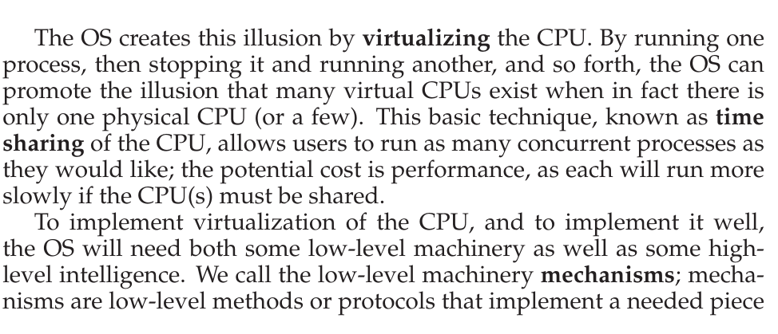

* Virtualization(Three Easy Pieces)

** The Process
*** A Process
- consititutes of a process
  1. memory
  2. address space
  3. registers
*** Process API
- Every OS must be included these ideas above
 *Create*: The OS is invoked to create a new process to run program you have indicated
 *Destroy*: A interface to halt runaway process is quite useful
 *Wait*: To wait for a process to stop running
 *Miscellaneous Control*: there are sometimes other controls that are possible. For example, some kind of method to suspend a process
 *Status*: Interfaces to get some status information about a Process

UNIX present two interfaces to create new process, both are fork() and exec()
- the fork() system call
#+begin_src C
#include<stdio.h>
#include<stdlib.h>
#include<unistd.h>

int main(int argc, char *argv[])
{
  printf("hello world (pid:%d)\n", (int) getpid());
  int rc = fork();
  if (rc < 0) { // fork failed; exit
    fprintf(stderr, "fork failed\n");
    exit(1);
  } else if (rc == 0) { // child (new process)
    printf("hello, I am child (pid:%d)\n", (int) getpid());
  } else { // parent goes down this path (main)
    printf("hello, I am parent of %d (pid:%d)\n",
	   rc, (int) getpid());
  }
return 0;
}
#+end_src

#+RESULTS:
| hello  | world | (pid:35191) |        |             |       |             |
| hello, | I     | am          | parent | of          | 35192 | (pid:35191) |
| hello  | world | (pid:35191) |        |             |       |             |
| hello, | I     | am          | child  | (pid:35192) |       |             |

  exact copy of the calling process. To the OS, there are two same programs is running.
- the exec() system call
  run different program(e.g. call /wc/ command in exec())
- the wait() system call

*** Process Creation: A Little More Detail                           

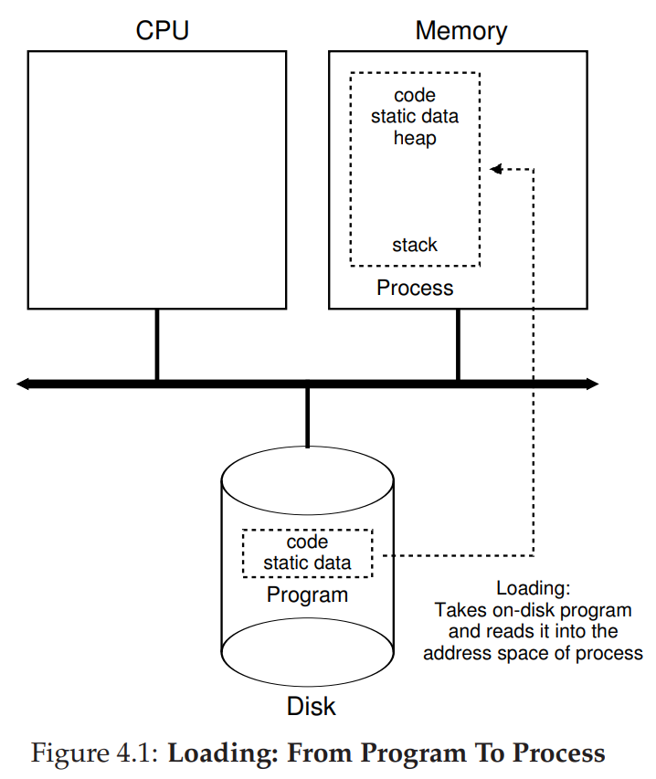

How does the OS get a program up and running?

The first thing that OS must load its code and any static data(e.g. initialized variables) into memory, into the address space of the process.

Once the code and data are loaded into memory, there are a few other things the OS needs to do before running the process.
- allocated run-time stack
- allocated heap for data explicitly request dynamically-allocated
- related to I/O setup

In early OSes, they load process is done eagerly. Now modern OSes perform the process lazily i.e., by loading pieces of code or data only as they needed during program

To truly understand how lazy loading of pieces of code and data, we have to understand more about the *pagin* and *swapping*(virtualization of memory)

Summary,before running anything, the OS clearly must do some work to get the important program bits from disk into memory
*** Process States
:PROPERTIES:
:ID:       c5dad7c5-80d7-4fa0-845b-c19e3846ac21
:ROAM_ALIASES: Process States
:END:
- Running
- Ready
- Blocked
[[file:images/clipboard-20260607T163538.png]
*** Data Structures
The OS need to track all of running program information using Data Structures(e.g. Link Table, HashMap, Queue)

** Mechanism: Limited Direct Execution
There are a few challenges
- The first is /performance/
- The second is /control/

*** Solution
:PROPERTIES:
:ID:       8d000676-3861-4688-8425-a1f60280ee5b
:END:
1. Restricted Operations
#+begin_quote
Direct execution has obvious advantage of being fast; the program run natively on hardware CPU. But there are a few problems of privilege if directly execute the program e.g. access any resources which is CPU or MEMORY,RESIGTER and so forth
#+end_quote

What approach OS has taken to isolate users and hardware
- user mode
  when running in the user mode, the process can't issue I/O request or allocate memory so forth. If doing so, the OS would then likely kill the process
- kernel mode(OS or kernel run in)
  In this mode, code that run can do what it likes, e.g. issue I/O requests and execute all types of restricted instructions, any operations needed privilege so forth

How to execute privileged operations by users mode
- Trap Instruction
  To execute a system call, the program must execute *trap* instruction. it simultaneously jumps to into the kernel and raises privilege level to kernel mode. Then the process can run any privilege operation was needed. while running end, the OS calls return-from-trap instruction, returns into the calling user program while simultaneously reduces the privilege level back to user mode

#+begin_quote
why system calls look like procedure calls? In C Programming,the C standard libraries have hidden many details for system calls(e.g. like open() or any of system calls provided).
#+end_quote
But we need a method to let the kernel jump into specify address(e.g. the process address of kernel stack), otherwise, anywhere of kernel the code jump into is a bad idea arbitrary
- Trap Table
  It is initialized by kernel at boot time. the table is likely a search table when the program execute system call.
#+begin_quote
There are other situations for Trap Table.
- *Exceptions* were triggered by CPU hardware when programs crash(e.g. Page Fault, invalid instructions)
- *Interrupt* were triggered external hardwares(e.g. mouse moving, receive data by net card, timer trigger)
#+end_quote
if only one of the situations above is triggerd, the trap handler program will handle it

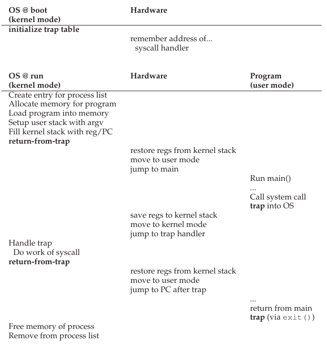
/*timeline for trap table set up*/

2. Switcing Between Context
   The OS need to decide which process to start and stop another when it suffer from trap. If process runs exclusively, the OS can't switch to run other processes.
- a cooperative approach: wait for system calls
- a non-cooperative approach: the OS takes control
- saving and restoring context

** scheduling
:PROPERTIES:
:ID:       f1e13995-ffc0-4418-bd40-0bfec1d520f2
:ROAM_ALIASES: scheduling
:END:
1. Workload Assumptions
a. Each job runs for the same amount of time.
b. All jobs arrive at the same time.
c. Once started, each job runs to completion.
e. The run-time of each job is known.
d. All jobs only use the CPU (i.e., they perform no I/O)

2. Scheduling Metrics
\[T_{turnaround} = T_{complete} - T_{arrival}\]
- the \(T_{arrival} \) indicate the time process arrival in the system
- the \(T_{complete}\) is time process have done on CPU
#+begin_quote
assume all jobs arrived at same time, hence \(T_{arrival} = 0 \)
#+end_quote
ppthere are two metrics for sheduling, one of turnaround time is *performance*, the other one is *fairness*

3. First In, First Out(or First Come, First Served)
   Just like the Queue of datastruct, consequently the job arrived first and running on CPU first
- average turnaround time
  assuming there are three jobs—A,B and C, each of jobs runs 10 seconds
\begin{equation}
\label{eq:2}
\frac{10+20+30}{3} = 20
\end{equation}

But if the job in front of scheduling queue is heavyweight resource consumer, the other jobs of relatively-short resource get queued behind it. This cause convey effect[fn:1]
Just like, assuming Job A runs for the full 100 seconds before B and C
| Job | Turnaround | priority |
| A   | 100s       |        1 |
| B   | 110s       |        2 |
| C   | 120s       |        3 |

- average turnaround time (aforementioned \(T_{arrival} = 0 \))

  \[\frac{100+110+120}{3} = 110 \]

--------------
[fn:1] *convey effect*:  the process of CPU-bound or heavyweight resource to consume runs exclusively on CPU. otherwise, there are a pile of processes need light resource to consume behind the heavy process

4. Shortest Job First
   It turn out a approach solve this problem, then the Queue will be
| Job | Turnaround | priority |
| B   | 10s        |        1 |
| C   | 20s        |        2 |
| A   | 120s       |        3 |

- average turnaroud time(aforementioned \(T_{arrival} = 0 \))
\[\frac{10+20+120}{3} = 50 \]

#+begin_quote
In the old days of batch computing, a number of non-preemptive schedulers were developed. Virtually all modern scheders are preemptive, stop one process from running in order to run another; in particular, the scheduler can perform *context switch*, stopping temporarily process is running and resuming(or starting) another
#+end_quote

before, we assumed the \(T_{arrival}\) equal 0. Now illustrating the other example. This time, Assume A arrives at \(t = 0 \) and needs to run for 100 seconds, whereas B and C arrive at \(t = 10\) and each need to run for 10 seconds. With pure SJF, it seen in

#+DOWNLOADED: screenshot @ 2026-06-17 14:38:39
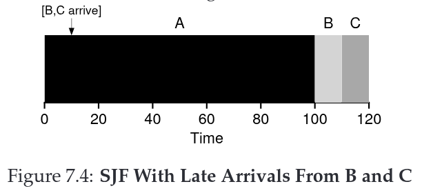
In particular, the Job B and C are forced to wait until Job A has completed. This looks like non-preemptive scheduler
- average turnaround time
  | Job | Turnaround | priority |
  | A   |      100-0 |        1 |
  | B   |     110-10 |        2 |
  | C   |     120-10 |        3 |

  \[\frac{100+100+110}{3} = 103.33 \]

5. Shortest Time-to-Completion First
   To address this concern, it can *preemt* job A with aforementioned acknowledge about *context switching* and *timer interrupts*. Just add preemption to SJF as the *Shortest Time-to-Completion First* or *Preemptive Shortest Job First* scheduler. With STCS in previous conditions, it seems in

#+DOWNLOADED: screenshot @ 2026-06-17 15:18:38
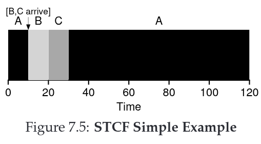

  | Job | Turnaround | priority |
  | A   |      120-0 | 1 » 3    |
  | B   |      20-10 | 2 » 1    |
  | C   |      30-10 | 3 » 2    |

- average turnaround time

\[\frac{(120-0)+(20-10)+(30-10)}{3} = 50 \]

6. New Metric: Response Time
   For users who interact with OS usually, a new metrix was born: *Response Time* —defined as the time from when the job arrives in a system to the first time it is scheduled
\(T_{response} = T_{firstrun} - T_{arrival} \)
#+begin_quote
The gap-time is preempted by interactive process
#+end_quote
imagine sitting at a terminal, typing, and having to wait 10 seconds to see a response from the system just because some other job got scheduled in front of yours: not too pleasant.

#+DOWNLOADED: screenshot @ 2026-06-22 17:16:20
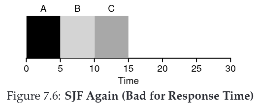

Thus, we are left with another problem: how can we build a scheduler
that is sensitive to response time? <<response_time>>

7. Round Robin Scheduling
   To solve [[response_time][this problem]], a new scheduling algorithm will be learned, classically referred to as Round Robin algorithm. The basic idea is simple: runs job for a  *Time Slice* (sometimes called a *scheduling quantum*) and then switches to the next job in the run queue. It reapeatlly does so until the jobs are finished. For this reason, RR called also *time-slicing*.

#+DOWNLOADED: screenshot @ 2026-06-22 17:15:52
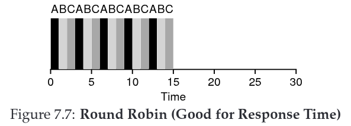

#+begin_quote
Note that, the length of time slice must be multiple of timer-interrupt period
#+end_quote
the length of time slice is critical for RR.The shorter it is , the better the performance of RR under the response-time metrix. But if making it long enough to amortize the cost of switching context without making it so long that system is no longer responsive

#+begin_quote
context switching does not arise solely from the OS actions of restoring and saving a few registers. Swithing to another job causes the state which are stored branch predictors, TLBs, in CPU caches is flushed
#+end_quote

More generally, any policy(such as RR ) that is *fair*. This is an inherent trade-off: if you are willing to be unfair, you can run shorter jobs to completion, but at the time of response time; if you want turnaround time is faster or better than it, the response time will be lowered. This type of *trade-off* is common in systems

8. Incorporating I/O
   If the jobs have operation of I/O, it will run exclusively on CPU without scheduling algorithm; just imagine two jobs A and B, both spend 10ms every time slice. But A is broken into 10ms excess sub-jobs (such as operation of I/O,responsive network)

#+DOWNLOADED: screenshot @ 2026-06-23 15:06:04
   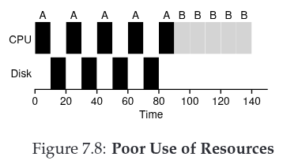

p   A coommon approach is to treat echo 10-ms sub-job of A as an independent job,With STCF, the choice is clear: choose the shorter one, in this case A. Then, when the first sub-job of A has completed, only B is left, and it begins running. Then a new sub-job of A is submitted, and it preempts B and runs for 10 ms. Doing so allows for overlap, with the CPU being used by one process while waiting for the I/O of another process to complete; the system is thus better utilized

#+DOWNLOADED: screenshot @ 2026-06-23 15:37:38
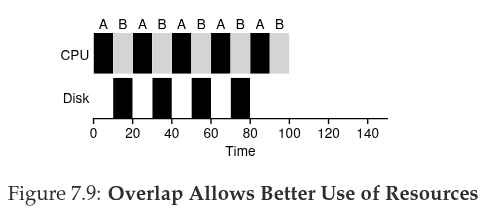

#+begin_quote
In fact, in a general-purpose OS,the OS usually knows very little about the length of echo job. So we need a approach without /priority/ knowleges and like SJF/SCTF
#+end_quote

** The Multiple-Level Feedback Queue

[^1]: **convey effect**: the process of CPU-bound or heavyweight
    resource to consume runs exclusively on CPU. otherwise, there are a
    pile of processes need light resource to consume behind the heavy
    process

    1.  Shortest Job First It turn out a approach solve this problem,
        then the Queue will be

      ----- ------------ ----------
      Job   Turnaround   priority
      B     10s          1
      C     20s          2
      A     120s         3
      ----- ------------ ----------

    -   average turnaroud time(aforementioned $T_{arrival} = 0 $)

    $$\frac{10+20+120}{3} = 50 $$

    > In the old days of batch computing, a number of non-preemptive
    > schedulers were developed. Virtually all modern scheders are
    > preemptive, stop one process from running in order to run another;
    > in particular, the scheduler can perform **context switch**,
    > stopping temporarily process is running and resuming(or starting)
    > another

** Address Spaces
*** three goals for virtualize memory
- transparency
    - it means opposite: that he illusion was provided by OS
- efficiency
    - OS make the virtulization as **efficiency** as possible, both time and space(just each of processes can't run much more time or slowly; can't cost more memory)
- protection
     - isolate processes, make sure that each of processes has private address spaces

*** Address Translation
OS with hardware's help turns the ugly physical mechanism into something that is useful, powerful, and easy to use abstraction
**** DOING Base and Bounds
- it need two registers within CPU; one is called **Base**, the other is called **Bound**. base-and-bound pair allow we to place anywhere in physical address
#+begin_quote
the technique is also referred to as **dynamic relocation**. because base-and-bound pair translate address occur in runtime, so we can move address spaces after the process has started running
#+end_quote

physical address = virtual address + base; if physical address less than bounds, the address is legal. And CPU will raise exception, if physical address out of bounds

disadvantage for dynamic relocation
1. internal fragmentation
    As it allocate a fixed-sized contiguous physical memory for entire process(include codes, heap, stack so forth), the spaces bettwen head and stack is internal fragmentation;

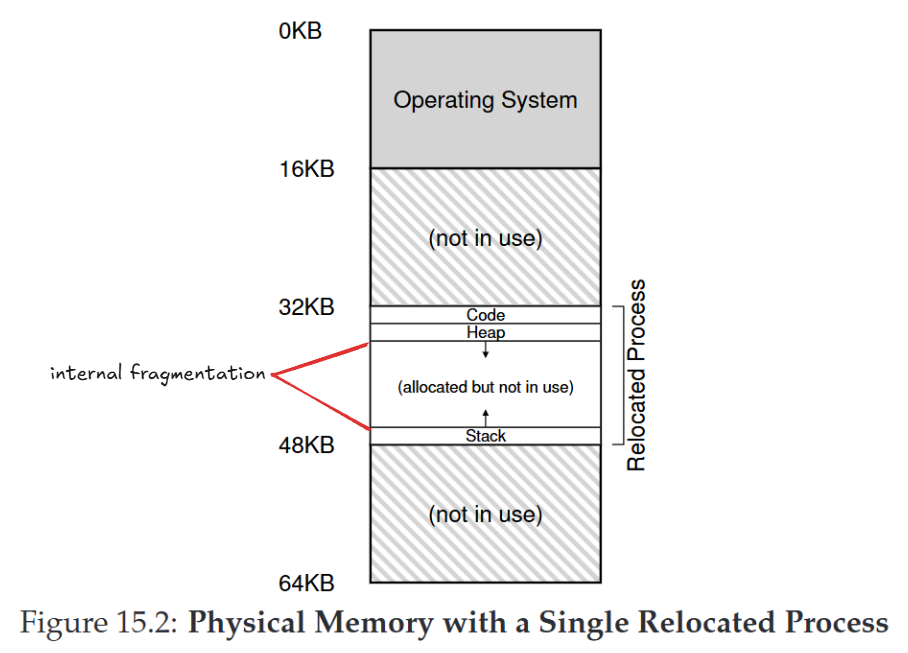

** DOING segmenation
:PROPERTIES:
:ID:       efdce789-cb76-45b6-912d-bf30095e3cc2
:END:

#+begin_quote
The base-and-bound pair below is inside one of CPU cache specilly, just one pair. Under the situation, the pair was used to switch context each of processes, just only one pair. It has cost performance additional. And it's not as flexible as we would like
#+end_quote
1. logical segmentation
each of logical segmentation(e.g. code, heap, stack) from process has a base-and-bound pair
| segment | Base | Size |
| Code    | 32K  | 2K   |
| Heap    | 34K  | 2K   |
| Stack   | 28K  | 2K   |

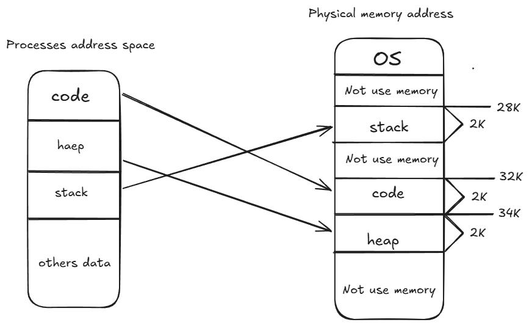
   .
Example
virtual address 4200 in the heap,In physical address space the heap of base is 28K. So the offset is 104 as 4200 minus 4096(as heap start at 4K in process address space), then the reflecting physical address is 28K plus 104

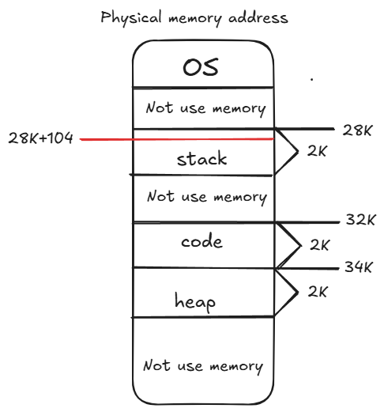

2. How to select segment we referring to correctly?
In vmx/vms system, it provided a explicit approach to chop up the address space into segment based on the top a few bits of virtual address

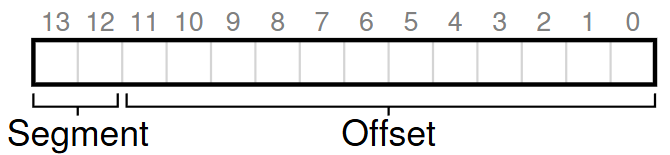

the top two bits is used to select which segments to locate physical address by offset(indicated by the others bits)

There is a implicit approach, the hardware determines segment how the address was formed.
Just like,The hardware will find the address from Code Segment if it's from Program Counter; if the address is based off of stack or base poniter, it must be in the stack segment, any other address must be in the heap

3. What about The Stack?

Heap growth in postive direction as the address is increasing; Stack with negative-growth. We need a bit to mark segment Grows Postive

| segment | Base | Size | Grows Postive |
| Code    | 32K  | 2K   |             1 |
| Stack   | 28K  | 2K   |             1 |
| Heap    | 34K  | 2K   |             0 |
#+begin_quote
1 indicate Growth postive, 0 in negative-growth
#+end_quote

4. Support for Sharing
   System designers soon realized that they could realize new type of efficiencs with a lot more hardware support. Specifically, it's useful to share certain memory segments between address spaces
   To support sharing, we need a little extra support from the hardware, in the form of *Protection Bits* add a few bits per segment to indicate the segment status— read-Execute, read-write, read-only so forth.

| segment | Base | Size | Grows Postive | Protection  |
| Code    | 32K  | 2K   |             1 | Read-Eexute |
| Stack   | 28K  | 2K   |             1 | Read-Write  |
| Heap    | 34K  | 2K   |             0 | Read-Write  |
Segment Register Values (with Protection)

By setting a code segment to read-only, the same code can be shared across multiple processes, without worry of harming isolation;

With protection bits, the hardware algorithm described earlier would also have to change. In addition to checking whether a virtual address is within bounds, the hardware also has to check whether a particular access is permissible.

5. Fine-grained & Coarse-grained Segmentation
   + far discussed segments(e.g code,stack,heap), we can think of they are coarse-grained segmentation
   + Some early systems(e.g. Multics) were more flexible and allowed for address spaces to consist of a large number of smaller segments, referred to *fine-grained* segmentation.

6. OS Support
   As learning about how segmentation works, Pieces of the address space are relocated into physical memory, and thus a huge savings of physical memory is achieved
   But, segments raises a number of new issues.
   1). How to do on a context switch?
   the segment registers must be saved and restored by OS
   2). External fragmentation
   as far as I konw, segmentation can be allocated in different size. If per process has a number of segments, consequently, whole chunks have been allocated is non-contiguous
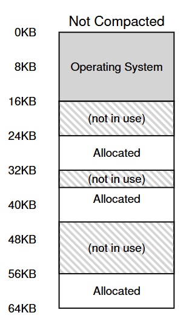

One solution to this problem would be to compact physical memory by rearranging the existing segments.
there are many algorithm polics to select which chunk will be rearranged by chunk status
+ best-fit
+ worst-fit
+ first-fit
+ buddy-algorithm

** Free-Space Management
In segments chapter, we know it left external fragmentation as system runs
Like the title, here introduce how to manage free spaces make physical memory efficiency of usage.

#+begin_quote
externam fragmentation is little pieces of different sizes and non-contiguous, it will case there is no signle contiguous space can satisfy the request
#+end_quote

#+begin_example
+-------------+            +-------------+             +-------------+
| size:10     |            | size:10     |             | size:10     |
| status:free | ---------> | status:used | ----------> | status:free |
|             |            |             |             |             |
+-------------+	           +-------------+             +-------------+
#+end_example

*** Low-level mechanisms

Splitting and Coalescing

Assume there is only 30 Byte have been allocated in heap, and the address of middle-part have been used

In this case, the request need the memory which more than 10 bytes, it's will fail to allocate and return NULL; there isn't singal contiguous chunk of memory of that size availabel

Assume it request for single byte of memory. In this case, the allocater will perform an action known as *splitting*: it will find free chunk of memory that satisfy the request and split it into two.
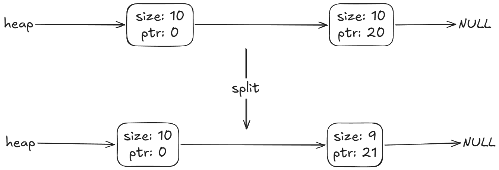

then the left chunk has been allocated to the request, the right chunk minus single byte

#+begin_quote
*Free List* structure contains references to all of free chunks of space in the managed region of memory; It will be created when resources was initialized (like disks initialization, allocated heap). In user-level allocated heap, it manage the free chunk of space references to visual address
/*the structure manage various objects in different scenes*/, this knowledge can be introduced by LLM
#+end_quote

A corollary mechanism in most allocator is known as *coalescing* of free space

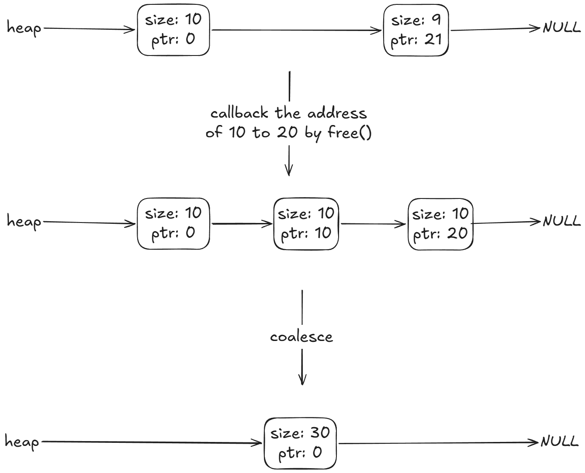

when managed region memory space have contiguous address, The machenism is triggerd to coalesce the chunks

**** Tracking the size of allocated regions

Why the free() accept only singal parameter which is a pointer to release the allocated region?

To accomplish this task, most allocators store a little of extra information in a header block which is kept in memory
It minimally contains the size of allocated region, also contain additional poniter to speed up deallocation, a magic number to verify integrity, and other information. the sence that here is we assume the header block contain only size of the allocated region and magic number

#+begin_src C
typedef struct __header_t {
  int size;
  int magic;
} header_t;
#+end_src

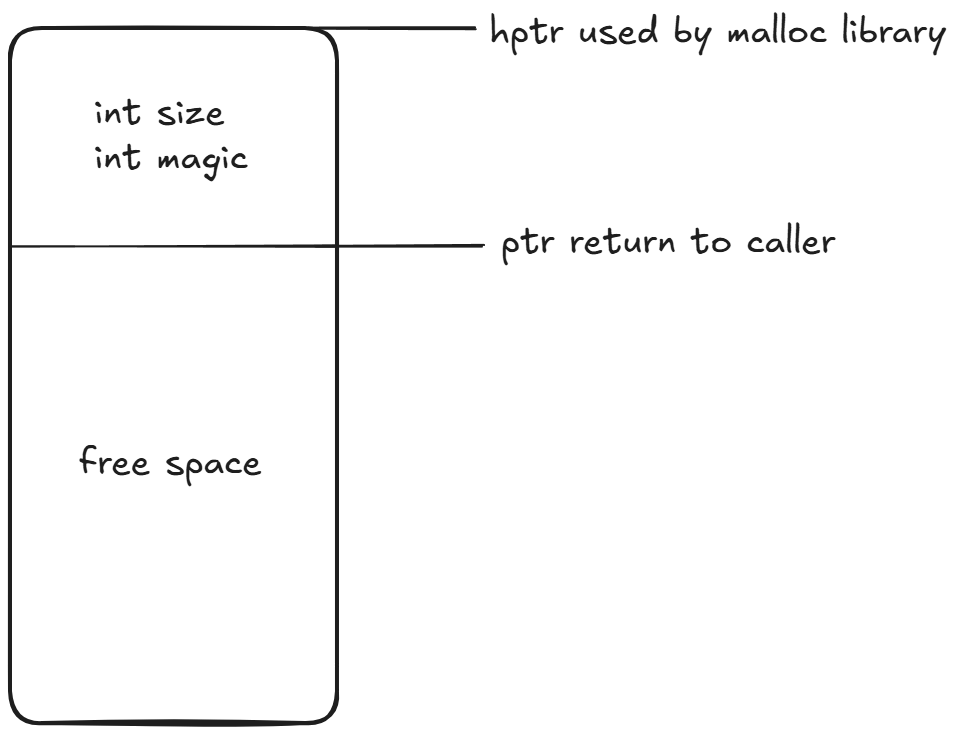

Thus far, we know it how to track the size and why the interface free() accept singal poniter parameter

#+begin_quote
why the size of allocated region need tracked?
#+end_quote

**** Embedding A Free List

maintained the said Free List as as separate unit. It cast additional performance overhead.
In more typical list, when you need space for the node by calling malloc(). Unfortunately, you can't do this in memory-allocation library. Instead, you need build the list inside the free space itself, as the subtitle stated.
why we need Embedding A Free List?
+ dynamic extend heap
+ management convience
+ and so forth,ask for LLM

Assume we get 4K heap via malloc(), and virtual addres is 16384

[[file:images/FreeSpace-Management/Embedding_Free_List.png]]

When the three chunks are freed, there are a few of fragments in heap. So we need merge the chunks by coalescing

*** DOING Basic Strategies
DEADLINE: <2026-08-27 Thu> SCHEDULED: <2026-08-27 Thu>

+ best fit
+ Worst Fit
+ First Fit
+ Next Fit
+ segregated Lists

